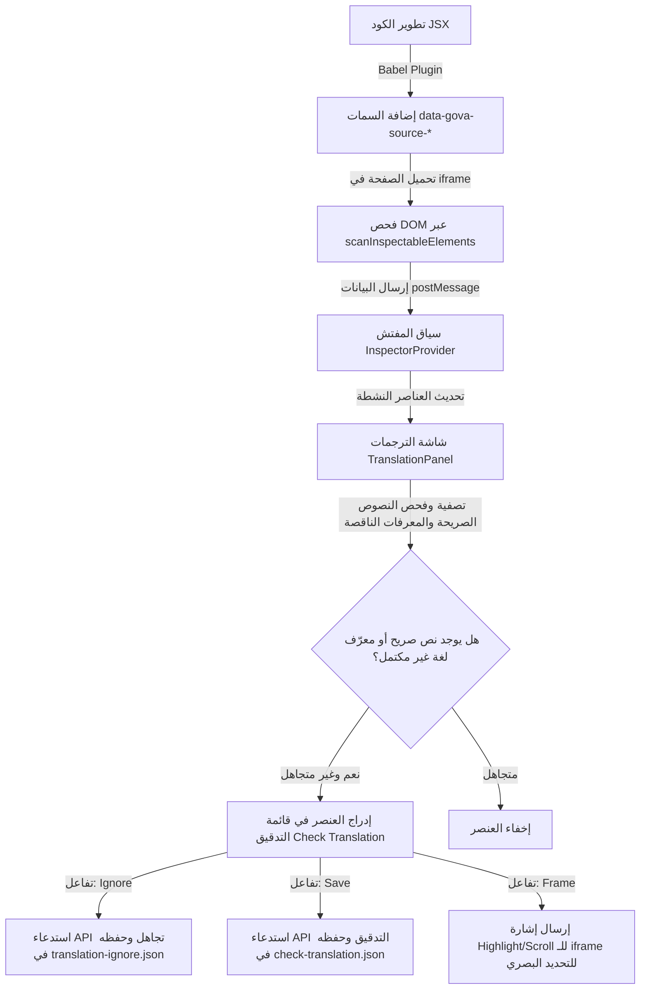

# تحليل نظام الترجمة في المشروع وأداة فحص واجهة المستخدم (UI Inspector)

هذا التقرير يقدم تحليلاً تفصيلياً وعميقاً لكود المشروع لمعرفة كيفية عمل نظام الترجمة (Translation System) بصفة عامة، وآلية تكامله وعمله على وجه الخصوص داخل أداة فحص واجهة المستخدم (`/devtools/ui-inspector`).

---

## أولاً: الهيكل العام لنظام الترجمة (General Translation System)

يعتمد نظام الترجمة في المشروع على **ربط هيكلي صارم (Strict Structural Coupling)** بين معرّفات عناصر واجهة المستخدم الفريدة (UI Identifiers) ومفاتيح الترجمة المقابلة لها (Translation Keys). هذا الربط يضمن عدم وجود عناصر يتيمة (Orphan Elements) أو ترجمات مفقودة.

### 1. دورة حياة ومسار الترجمة في المكونات (React Components)

عندما يريد مكون ما عرض نص مترجم، فإنه يتبع المسار التالي:
1. **استدعاء الخطاف (Hook):** يتم استدعاء خطاف الترجمة `useTranslation` من ملف [useTranslation.ts](file:///c:/Users/hesham/Desktop/gova/src/platform/ui/i18n/core/useTranslation.ts).
2. **تمرير المصدر (Source):** يتم استدعاء الدالة الترجومية `t()` وتمرير المصدر إليها. هذا المصدر يمكن أن يكون:
   * **معرّف هوية رسومي (UI Identity Object):** كائن مسجل في سجل الهويات الرسومية (مثل `TEST1.PAGE.TITLE` المستورد من `@/platform/ui`).
   * **مفتاح ترجمة صريح (Translation Key):** سلسلة نصية مثل `'home.title'`.
3. **تحويل الهوية الرسومية إلى مفتاح ترجمة:** إذا كان المصدر هو كائن `UI Identity` (يحتوي على `uuid` و `path`)، يتم تمريره إلى دالة [resolveTranslationSource.ts](file:///c:/Users/hesham/Desktop/gova/src/platform/ui/i18n/core/resolveTranslationSource.ts#L20-L33) التي تقوم بما يلي:
   * التحقق مما إذا كان العنصر يتطلب ترجمة أم لا عن طريق `isTranslationRequiredForUiIdentity(source)`.
   * إذا كان يتطلب ترجمة، يتم استدعاء الدالة `generateTranslationKeyFromUi(source.path)` من ملف [registry-binding.ts](file:///c:/Users/hesham/Desktop/gova/src/platform/ui/i18n/binding/registry-binding.ts#L130-L143) لتحويل مسار المعرف الرسومي (مثال: `test1.form.save-button`) إلى مفتاح الترجمة المطلوب (مثال: `test1.form.saveButton`) عبر تحويل الكلمة الأخيرة من صيغة **kebab-case** إلى **camelCase**.
4. **التحقق من الحدود الإقليمية (Boundary Validation):** بعد استخراج مفتاح الترجمة، يتم التحقق مما إذا كان هذا المفتاح مسموحاً استخدامه ضمن الميزة الحالية (Feature) للمسار الحالي، عن طريق دالة `validateTranslationKey(key, feature)` في ملف [enforceBoundary.ts](file:///c:/Users/hesham/Desktop/gova/src/platform/ui/i18n/core/enforceBoundary.ts#L54-L57). تفرض هذه الدالة ألا تستخدم ميزة معينة إلا ملف ترجماتها المخصص أو الملفات المشتركة العامة (`common`, `navigation`, `buttons`, `shared-layout`, الخ).
5. **استخراج الترجمة الفعلي (Dictionary Lookup):** يتم البحث عن القيمة الموافقة للمفتاح بصيغة النقطة (Dot Notation) داخل القاموس المدمج عبر دالة `t()` في ملف [t.ts](file:///c:/Users/hesham/Desktop/gova/src/platform/ui/i18n/core/t.ts#L11-L48). في بيئة التطوير (`development`)، إذا كان المفتاح مفقوداً، يتم تسجيل خطأ في وحدة التحكم ورجوع النص الاحتياطي بصيغة `[missing:key]`.

---

### 2. تجميع القواميس وإدارة الجلسة (Dictionary Compiling & Management)

* **القاموس الموحد:** يتم تحميل جميع ملفات الترجمة (مثل `en.json` و `ar.json` الموزعة في مجلدات الميزات داخل [locales](file:///c:/Users/hesham/Desktop/gova/src/platform/ui/i18n/locales)) ودمجها بالكامل في شجرة كائنات واحدة باستخدام الدالة `getAppDictionary(locale)` المتواجدة في [getDictionary.ts](file:///c:/Users/hesham/Desktop/gova/src/platform/ui/i18n/core/getDictionary.ts#L237-L252).
* **إدارة السياق (I18nProvider):** يوفر [provider.tsx](file:///c:/Users/hesham/Desktop/gova/src/platform/ui/i18n/core/provider.tsx) سياقاً موحداً يحتوي على اللغة الحالية، دالة لتغيير اللغة (والتي تستخدم المتجر المشترك `useUnifiedStore` كمرجع أساسي للبيانات)، وشجرة القاموس الكاملة بعد دمجها، وتحديد الميزة الحالية المناسبة للصفحة تلقائياً عبر فحص رابط الصفحة (`pathname`).

---

### 3. أدوات التحقق وصيانة الترجمات (Enforcement & Audit Scripts)

لضمان تطابق الترجمات وخلو الكود من المشاكل، توجد مجموعة من السكريبتات المؤتمتة:
1. **[generate-translation-keys.ts](file:///c:/Users/hesham/Desktop/gova/src/platform/ui/enforcement/scripts/generate-translation-keys.ts):** يقرأ ملفات `en.json` لجميع الميزات ويقوم بتوليد ملف تعريف الأنواع البرمجية [translation-keys.d.ts](file:///c:/Users/hesham/Desktop/gova/src/platform/ui/i18n/translation-keys.d.ts) تلقائياً لتوفير تدقيق أوتوماتيكي كامل أثناء كتابة الكود عبر TypeScript لمفاتيح الترجمة.
2. **[sync-translations.ts](file:///c:/Users/hesham/Desktop/gova/src/platform/ui/enforcement/scripts/sync-translations.ts):** يقوم هذا السكريبت بالمرور على جميع معرفات واجهة المستخدم النشطة والمطالبة بالترجمة، واستنتاج مفاتيحها المناسبة، ثم التحقق من وجودها في ملفات الترجمة لكل من الإنجليزية والعربية. وفي حال غياب المفتاح، يقوم بإضافته تلقائياً، مستخدماً الوصف المدخل في السجل كقيمة افتراضية للإنجليزية، وبصيغة `TODO(ar): Description` للعربية، لضمان تزامن اللغات.
3. **[validate-translations.ts](file:///c:/Users/hesham/Desktop/gova/src/platform/ui/enforcement/scripts/validate-translations.ts):** يتحقق من تطابق تام في الهيكل والملفات بين `en.json` و `ar.json` لكل الميزات، ويتحقق من الالتزام بصيغة camelCase للكلمات الطرفية (Leaves).
4. **[validate-registry-bindings.ts](file:///c:/Users/hesham/Desktop/gova/src/platform/ui/enforcement/scripts/validate-registry-bindings.ts):** يتحقق من أن كل معرف واجهة مستخدم مدعوم بـ UUID يتطلب ترجمة، يمتلك بالفعل مفتاح ترجمة موافق وصحيح في ملفات اللغات.
5. **[usage-scanner.ts](file:///c:/Users/hesham/Desktop/gova/src/platform/ui/enforcement/scripts/usage-scanner.ts):** يمسح ملفات الكود المصدري للبحث عن استخدامات المعرفات الرسومية ومفاتيح الترجمة ومطابقتها مع السجلات للعثور على العناصر غير المستخدمة (Orphans).

---

## ثانياً: آلية الترجمة وفحصها داخل Devtools UI Inspector

أداة فحص واجهة المستخدم (UI Inspector) هي لوحة تطويرية تتيح فحص التطبيق وتعديل سلوكه وتحديد الأخطاء البرمجية. تعمل من خلال آلية اتصال ورسم طبقات فوق صفحات التطبيق المستضافة.

### 1. جسر الاتصال وتتبع العناصر (Iframe Communication & Element Scanning)

عند فتح لوحة الفحص عبر المسار `/devtools/ui-inspector`، يتم تحميل التطبيق الفعلي داخل نافذة مستعرض فرعية (`<iframe>`). يتم تحقيق التنسيق والتحكم عبر الآلية التالية:
* **جسر الإشارات (UiInspectorFrameBridge):** يحدد بروتوكول اتصال مبني على `postMessage` مسمى بـ `gova-ui-inspector` عبر ملف [UiInspectorFrameBridge.ts](file:///c:/Users/hesham/Desktop/gova/src/platform/ui/devtools/UiInspectorFrameBridge.ts).
* **جامع الفحص (InspectCollectorBridge):** مكون غير مرئي يتم حقنه في صفحات التطبيق [UiInspectCollector.tsx](file:///c:/Users/hesham/Desktop/gova/src/platform/ui/devtools/UiInspectCollector.tsx). عند اكتشاف تحميل الصفحة داخل الـ iframe، يرسل إشارة `READY` ويبدأ بمراقبة شجرة DOM للتطبيق باستخدام `MutationObserver`. عند حدوث أي تعديل في العناصر أو خصائصها، يجدول عملية مسح جديدة للصفحة.
* **فحص عناصر الصفحة (Scanning Elements):** يتم استدعاء دالة `scanInspectableElements()` المتواجدة في [inspect-collector-utils.ts](file:///c:/Users/hesham/Desktop/gova/src/platform/ui/devtools/inspect-collector-utils.ts#L22-L134):
  * تبحث الدالة عن العناصر التي تملك السمة `data-ui-uuid` لاسترجاع بياناتها المسجلة من كود المصدر.
  * العناصر التي **لا تملك** هذا المعرف الفريد، يتم استخراج معلومات التموضع الخاص بها في الكود المصدري (الملف، السطر، العمود، المكون) بالاستعانة بالسمات المضافة من قِبل الـ Babel Plugin المخصص للتطوير [babel-plugin-dev-source-markers.js](file:///c:/Users/hesham/Desktop/gova/babel-plugin-dev-source-markers.js) والذي يقوم بحقن سمات `data-gova-source-*` لجميع عناصر JSX أثناء العمل في بيئة التطوير فقط.
  * تقوم أيضاً باستخلاص السمة الخاصة بالترجمة `data-ui-lang-uuid` والنص المعروض `textContent` كلقطة برمجية (`textSnippet`).
  * تُرسل نتائج الفحص كقائمة برمجية عبر رسالة `SCAN_RESULT` إلى لوحة الفحص الأب.

---

### 2. آلية عمل فحص وتدقيق التراجم (Translation Checking in Inspector)

داخل لوحة الفحص، يظهر قسم الترجمة المدار عبر المكون [TranslationPanel.tsx](file:///c:/Users/hesham/Desktop/gova/src/platform/ui/devtools/ui-inspector/components/TranslationPanel.tsx). تعتمد تصفيته وتدقيقه للعناصر على منطق متكامل كالتالي:

#### أ. تحديد أخطاء الترجمات (Translation Checks):
يتم ترشيح وفحص عناصر واجهة المستخدم المستلمة من لقطة الفحص النشطة (`state.elements`) بناءً على القواعد التالية:
1. **فحص النصوص الصريحة (Hardcoded Text):** إذا كان العنصر يحتوي على نص صريح معروض في المتصفح (`textSnippet.length > 0`) ولكن ليس لديه ترجمة مسجلة.
2. **معرّف غير مكتمل (Incomplete Translation UUID):** إذا وجد أن العنصر يمتلك سمة `data-ui-lang-uuid` تبدأ بـ `lang-` (مما يشير إلى نية ربطه بالترجمة كـ UUID للغة ولكنه غير معرّف أو مكتمل بعد في السجل).
3. إذا تحقق أي من الشرطين السابقين، يُنشئ المكون كائناً من نوع `CheckTranslationItem` يمثل مشكلة ترجمة محتملة. يتم حساب معرّف فريد لهذا العنصر (`key`) باستخدام تفاصيل مكانه في كود المصدر ورابط الصفحة الحالي عبر الدالة `createTranslationItemKey`.

#### ب. تجاهل العناصر (Ignore Translation):
* يتيح Inspector للمطور استبعاد وتجاهل العناصر التي لا تحتاج لترجمة (مثل النصوص الديناميكية البحتة أو الأرقام) عن طريق النقر على زر **Ignore**.
* يقوم المكون بإرسال طلب `POST` إلى نقطة النهاية `/api/ui-inspector/translation-ignore` مصحوباً ببيانات العنصر المستبعد.
* يقوم مسار واجهة البرمجة [route.ts](file:///c:/Users/hesham/Desktop/gova/src/app/api/ui-inspector/translation-ignore/route.ts) بحفظ وحذف هذه السجلات بشكل مستمر داخل ملف JSON مخصص في التطوير تحت المسار:
  `data/ui-inspector/translation-ignore.json`.
* العناصر الموجودة في هذا الملف يتم استبعادها تلقائياً من الظهور في قائمة "Check Translation".
* يمكن إرجاع أي عنصر متجاهل عبر خيار **Return** الذي يستدعي طلب `DELETE` لنفس نقطة النهاية لحذفه من ملف التجاوز.

#### ج. حفظ المراجعات (Saving Translation Checked Items):
* عند النقر على زر **Save** في لوحة الفحص، يتم إرسال جميع مشاكل الترجمة غير المتجاهلة النشطة حالياً عبر طلب `POST` إلى نقطة النهاية `/api/ui-inspector/check-translation`.
* يقوم مسار الخدمة [route.ts](file:///c:/Users/hesham/Desktop/gova/src/app/api/ui-inspector/check-translation/route.ts) بكتابة وحفظ هذه السجلات بالكامل داخل الملف النشط حالياً في بيئة التطوير:
  [check-translation.json](file:///c:/Users/hesham/Desktop/gova/data/ui-inspector/check-translation.json).
* يُستخدم هذا الملف كتقرير مستمر للأماكن التي تتطلب تحويلاً إلى نصوص مترجمة أو ربطاً بنظام اللغات داخل التطبيق.

#### د. التفاعل والتحديد البصري (Visual Framing & Highlighting):
* عند النقر على زر **Frame** لأي عنصر مسجل في لوحة الترجمات، يتم إرسال طلب `SCROLL` و `HIGHLIGHT` مصحوباً بـ `scanKey` الخاص بالعنصر عبر الـ postMessage إلى الـ iframe.
* يستجيب جامع الفحص النشط في الـ iframe من خلال دالتي `scrollToInspectableElement` و `highlightInspectableElement` للتنقل الفوري للعنصر وتلوينه بإطار أزرق غامق وشفاف لتسهيل معرفة موقعه المادي في التصميم المرئي.

#### هـ. قيود التسجيل (Registration Purpose Restriction):
* إذا رغب المطور في تسجيل عنصر جديد يدوياً وإنشاء معرف UUID له مباشرة من المتصفح عبر نقر **Create UUID**، يتم استدعاء مسار التسجيل الفوري [route.ts](file:///c:/Users/hesham/Desktop/gova/src/app/api/ui-inspector/register-element/route.ts).
* يمتلك هذا المسار قيداً هاماً: يمنع تسجيل عناصر الترجمات مباشرة من خلاله ويقوم برفض الطلب وإرجاع خطأ `400` إذا كان الغرض المطلوب للتسجيل هو الترجمة (`translation` أو `both`):
  ```typescript
  if (body.requestedPurpose === 'translation' || body.requestedPurpose === 'both') {
    return NextResponse.json(
      { error: 'Translation UUIDs must use data-ui-lang-uuid="lang-..." via check-translation JSON.' },
      { status: 400 }
    );
  }
  ```
  هذا يعني أن المشروع يفرض مساراً صارماً يقضي بأن معرفات ترجمة اللغة يجب أن تمر عبر سمة `data-ui-lang-uuid="lang-..."` ومن خلال التقارير المحفوظة في ملف JSON الخاص بعمليات تدقيق الترجمات، بدلاً من إدراجها مباشرة كمعرفات أجهزة رسومية تقليدية عبر هذه الواجهة البرمجية.

---

## ملخص هيكلي للتدفق البرمجي للترجمات داخل المفتش


